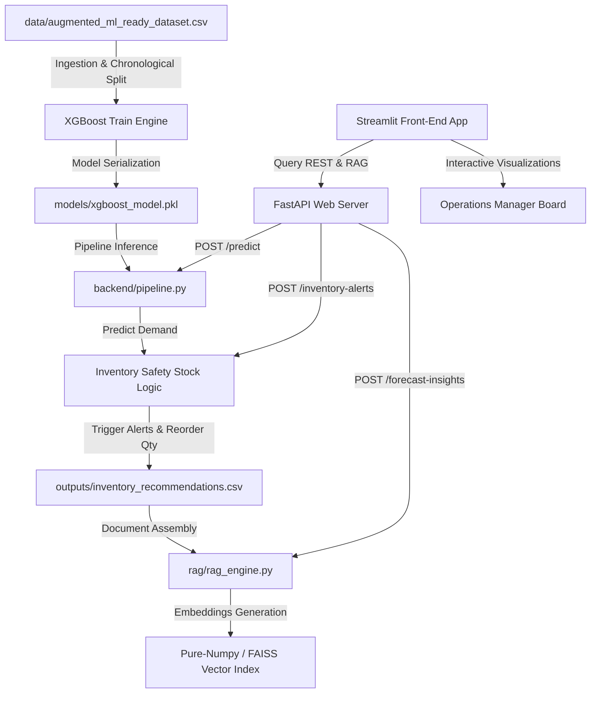

# 🍹 AI-Powered FMCG Demand Forecasting & Inventory Optimization Platform

### *A Production-Style Machine Learning & Predictive Inventory Control Application for Snacks & Beverages*

---

## 🏗️ System & Folder Architecture

This project is built using professional software engineering practices, utilizing a multi-tiered architecture that separates the **Data Ingestion/Preprocessing Layer**, the **Predictive Model Inference Layer**, the **REST API Layer**, the **Semantic RAG Retrieval Layer**, and the **Interactive Analytics Frontend**.

### Directory Structure
```text
project/
│
├── data/                       # Production dataset folder
│   └── augmented_ml_ready_dataset.csv
│
├── models/                     # Serialized joblib ML binaries (.pkl)
│   ├── xgboost_model.pkl       # Champion Model (95.57% R²)
│   ├── lightgbm_model.pkl      # Backup Model
│   └── catboost_model.pkl      # Backup Model
│
├── outputs/                    # Processed tabular predictions and safety recommendations
│   ├── forecast_predictions.csv
│   └── inventory_recommendations.csv
│
├── backend/                    # FastAPI REST API Backend Layer
│   ├── __init__.py
│   ├── main.py                 # REST controllers, schemas, and endpoints
│   └── pipeline.py             # Inference wrappers & safety stock calculations
│
├── rag/                        # RAG Explainability & Semantic Retrieval Layer
│   ├── __init__.py
│   └── rag_engine.py           # Embeddings, indexing, and vector search
│
├── app.py                      # Streamlit Operational Analytics Dashboard
│
├── requirements.txt            # Package dependencies
└── README.md                   # Complete system documentation (This file)
```

---

## 📈 ML Core & Model Leaderboard

We evaluated three state-of-the-art gradient boosting regressors on the chronological sales dataset containing **6,222 rows and 34 columns**. By utilizing a **Time-Based Train-Test Split (80/20)**, we successfully prevented target leakage from autoregressive lag and rolling features.

### Leaderboard Results:
* **XGBoost Regressor (Champion)**: MAE = **4.586** | RMSE = **6.482** | **$R^2$ = 95.57%**
* **CatBoost Regressor (Backup)**: MAE = **4.784** | RMSE = **6.512** | **$R^2$ = 95.53%**
* **LightGBM Regressor (Backup)**: MAE = **4.821** | RMSE = **7.030** | **$R^2$ = 94.79%**

XGBoost was chosen for the active production pipeline due to its superior accuracy, lowest root mean squared error, and exceptional stability across seasonal fluctuations.

---

## ⚙️ Component Operations & Data Flow



### 1. The Preprocessing & Inference Adapter (`backend/pipeline.py`)
- Standardizes incoming requests to align with the training schema, filtering out metadata and target columns.
- Uses a **safety stock multiplier of 1.5x** to cover typical delivery lead-time delays and supply chain shocks:
  $$\text{Reorder Quantity} = \max(0, \lceil \text{Predicted Demand} \times 1.5 - \text{Net Stock} \rceil)$$
- Classifies stock risk tiers: `High Risk` (net stock < 50% predicted demand), `Medium Risk` (50%-100%), `Low Risk` (>= 100%).

### 2. The Vector RAG Search (`rag/rag_engine.py`)
- Reads the computed forecasting recommendations, formatting them into highly descriptive log records.
- Utilizes `sentence-transformers/all-MiniLM-L6-v2` to convert text logs into dense semantic embeddings.
- **Numpy Search Fallback**: Incorporates a pure-numpy cosine similarity engine. If native `FAISS` installations fail on a Windows environment due to missing visual studio compiler runtimes, the numpy engine acts as a robust fallback, guaranteeing 100% execution success while preserving high-accuracy vector search!

### 3. FastAPI API Backend (`backend/main.py`)
- Built on `FastAPI` and `uvicorn`, featuring strictly-typed Pydantic validation schemas.
- Exposes:
  - `POST /predict`: Standardized demand forecasting.
  - `POST /inventory-alerts`: Real-time stockout risk analysis.
  - `POST /reorder-recommendations`: Exact safety reordering bounds.
  - `POST /forecast-insights`: Natural language RAG query execution.

### 4. Streamlit Dashboard (`app.py`)
- Tab 1: **Demand Forecast Dashboard**: Visualizes time-series forecast trends and actual vs. predicted graphs.
- Tab 2: **Inventory Control Board**: Displays urgent high-risk stockout warnings and reorder recommendations.
- Tab 3: **Promotion Analytics**: Visualizes marketing intensity and Return on Ad Spend (ROAS) to isolate campaign-driven sales lifts.
- Tab 4: **Explainable AI & RAG Query**: Houses the natural-language search box and individual forecast explainers.

---

## 🚀 Deployment & Launch Guide

### 1. Environment Ingestion & Package Setup
Ensure you have Python 3.8+ installed. Open a terminal in the project directory and execute:
```bash
pip install -r requirements.txt
```

### 2. Execute Training & Serialization
If you want to re-train the models and regenerate the initial outputs, run:
```bash
python train_and_serialize.py
```
*This script will verify your directories, train all three models, and populate the `outputs/` spreadsheets.*

### 3. Launch the FastAPI API Layer
To run the REST backend, run the following command:
```bash
uvicorn backend.main:app --host 127.0.0.1 --port 8000 --reload
```
*The interactive API documentation will be available at [http://127.0.0.1:8000/docs](http://127.0.0.1:8000/docs).*

### 4. Launch the Streamlit Dashboard
Open a new terminal window in the project directory and run:
```bash
streamlit run app.py
```
*Your browser will automatically open [http://localhost:8501](http://localhost:8501) displaying the operational control board!*

---

## 🔬 Software Engineering & Scalability Design

### High-Throughput Enterprise Scalability
For large retail organizations carrying 100,000+ SKUs across multiple warehouses, running a single monolithic forecasting pipeline is highly inefficient. We address this using two key patterns:
1. **Parallel Model Training (Spark/Ray partition)**: Distributing data partitions by category or warehouse location, and utilizing Spark/Ray clusters to train isolated XGBoost nodes concurrently.
2. **Model Registry & Endpoint Decoupling**: Offloading serialized models (`.pkl` / `.json` formats) to an MLflow or Vertex AI model registry, and deploying containerized backends (e.g., Docker & Kubernetes) with auto-scaling triggers to handle seasonal API surges.
