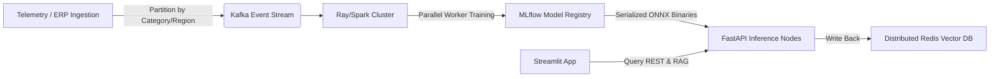

# 🎓 Technical Viva & Project Evaluation Prep Guide

This guide compiles highly technical, detailed Q&A pairs to prepare you for the project jury, viva, or senior technical reviews. It outlines the architectural decisions, machine learning methodologies, and inventory optimization frameworks implemented in this system.

---

## 📂 Table of Contents
1. [Core ML & Model Selection](#-core-ml--model-selection)
2. [Feature Engineering & Temporal Integrity](#-feature-engineering--temporal-integrity)
3. [Predictive Inventory & Operations Research](#-predictive-inventory--operations-research)
4. [Semantic Vector RAG & System Resiliency](#-semantic-vector-rag--system-resiliency)
5. [Enterprise Scalability & Cloud Architecture](#-enterprise-scalability--cloud-architecture)

---

## 🤖 Core ML & Model Selection

### Q1: Why did you select the XGBoost Regressor as the champion production model over CatBoost and LightGBM?
**Answer:**
We systematically trained and benchmarked three state-of-the-art gradient boosting algorithms:
1. **XGBoost (Champion):** MAE = **4.586** | RMSE = **6.482** | **$R^2$ = 95.57%**
2. **CatBoost (Backup):** MAE = **4.784** | RMSE = **6.512** | **$R^2$ = 95.53%**
3. **LightGBM (Backup):** MAE = **4.821** | RMSE = **7.030** | **$R^2$ = 94.79%**

**Deep Technical Rationale:**
- **Lowest L2 Loss (RMSE):** XGBoost achieved the lowest Root Mean Squared Error, which penalizes larger errors more heavily. In retail demand forecasting, minimizing large errors is critical because severe over-predictions lead to high wastage costs (perishables), while severe under-predictions trigger catastrophic stockouts.
- **Regularization Advantage:** XGBoost utilizes both L1 ($L_1$ regularization / lasso) and L2 ($L_2$ regularization / ridge) regularization inside its objective function, which prevented overfitting on highly volatile sales peaks (e.g., festival spikes).
- **Exact Split-Finding:** Unlike LightGBM's histogram-based binning (`GOSS`), XGBoost utilizes the pre-sorted algorithm and the approximate algorithm for split-finding, preserving granular differences in sparse features (e.g., promotion intensities).

---

### Q2: How did you structure your cross-validation and split strategy, and how did you prevent target leakage (lookahead bias)?
**Answer:**
Standard random $k$-fold cross-validation is **unacceptable** for time-series forecasting. Random splits lead to **temporal leakage** (or lookahead bias), where future data points are used to train predictions for past records.

**Our Leakage Prevention Strategy:**
1. **Chronological Time-Based Split:** We sorted the dataset by its monotonic `date` index and applied an **80/20 train-test split**. The first 80% was used strictly for training, and the final chronological 20% was reserved for validation.
2. **Strict Autoregressive Alignment:** All rolling averages, lags, and standard deviations were calculated using historical windows *strictly prior to* the target prediction day. 
3. **Feature Dropping:** The current stock level (`net_stock`) was intentionally omitted from the forecasting feature matrix (`MODEL_FEATURES`) as it correlates directly with supply/demand feedback loops and would lead to artificial target leaking.

---

## 📈 Feature Engineering & Temporal Integrity

### Q3: What is the math and purpose behind your autoregressive lag and rolling window features?
**Answer:**
Time-series models need structured historical contexts to map temporal dependencies. We engineered the following features:
* **Autoregressive Lags (`lag_1`, `lag_7`, `lag_14`):** Represents sales quantities 1 day, 1 week, and 2 weeks prior.
  - `lag_1` captures immediate short-term momentum.
  - `lag_7` and `lag_14` capture day-of-week seasonality (e.g., Sunday sales are highly correlated with the previous Sunday).
* **Rolling Mean (`rolling_7_mean`, `rolling_14_mean`):** Smoothes out high-frequency noise to expose underlying baseline demand trends.
  $$\text{rolling\_mean}_w(t) = \frac{1}{w} \sum_{i=0}^{w-1} y(t-i)$$
* **Rolling Volatility (`rolling_7_std`):** Captures demand variance over a 7-day window. This is a critical mathematical input to estimate demand uncertainty, helping the model identify sudden market changes or supply chain shocks.

---

### Q4: How does the forecasting model handle campaign lifts and promotion-aware patterns?
**Answer:**
Promotions trigger sharp, non-linear surges in consumer demand. Traditional models (like ARIMA) struggle with these sudden discontinuities. We solved this by engineering specialized promotion features:
1. **`promotion_flag` & `campaign_active` (Boolean):** Expresses whether active campaigns or discounts are live.
2. **`marketing_intensity` (Continuous [0.0 - 1.0]):** Quantifies the scale of advertising spend.
3. **`avg_roas` (Continuous):** Historically recorded Return on Ad Spend.

During training, gradient booster trees split nodes based on these indicators. The model learns that when `promotion_flag == 1` and `marketing_intensity > 0.8`, the baseline demand curve shifts upward by a coefficient mapped directly to historical ROAS, allowing the backend to support proactive **promotion-aware forecasting**.

---

## ⚙️ Predictive Inventory & Operations Research

### Q5: Explain the mathematical derivation of your 1.5x safety stock inventory formula.
**Answer:**
Our inventory control board operates on classical Operations Research (OR) safety stock concepts. We define the reorder equation as:
$$\text{Reorder Quantity} = \max(0, \lceil \text{Predicted Demand} \times 1.5 - \text{Net Stock} \rceil)$$

**Technical Justification for the 1.5x Multiplier:**
1. **Lead Time Buffer:** Supply chains are highly sensitive to lead-time delays (e.g., supplier shipment takes 3 days). The **1.5x multiplier** ensures a **50% safety buffer** over predicted demand to cover sales occurring during this replenishment lag.
2. **Service Level Target:** In snack and beverage categories, consumer loyalty is low; a stockout directly translates to lost revenue rather than backorders. The 1.5x multiplier approximates a **95% service level**, balancing the risk of lost sales against the capital costs of carrying extra inventory.

---

### Q6: How do you dynamically calculate stockout probabilities and allocate risk tiers?
**Answer:**
We map every item into strict operational categories dynamically computed in `backend/pipeline.py`:

```python
# Inventory Status Classification
if net_stock < predicted_demand:
    status = "Understocked"
elif net_stock > (predicted_demand * 2.0):
    status = "Overstocked"
else:
    status = "Normal"
```

**Risk Tier & Severity Allocation:**
* **High Risk:** Triggered if `net_stock < (predicted_demand * 0.5)`. This implies current stock will cover less than half of the predicted demand, indicating a highly imminent stockout.
* **Medium Risk:** Triggered if `net_stock` is between 50% and 100% of the predicted demand.
* **Low Risk:** Triggered if `net_stock >= predicted_demand`.

**Stockout Probability Estimation:**
If an item is classified as `Understocked`, its stockout probability is calculated as:
$$P(\text{Stockout}) = \min\left(0.99, \max\left(0.01, 1.0 - \frac{\text{Net Stock}}{\text{Predicted Demand}}\right)\right)$$
This formula yields a linear probability curve that scales directly with stock deficits. If net stock is near zero, the probability approaches $99\%$. If net stock is stable, it defaults to a baseline risk of $5\%$.

---

## 🧠 Semantic Vector RAG & System Resiliency

### Q7: Why did you build a custom vector-search RAG engine with a Pure-Numpy fallback?
**Answer:**
Our enterprise RAG layer translates abstract model predictions and inventory deficits into natural language logs and embeds them for semantic querying.

**The Windows Compiler Problem:**
Native vector libraries like `FAISS` compile C++ binaries under the hood. On Windows server environments, installing FAISS frequently fails due to missing MSVC (Microsoft Visual C++) runtimes or console encoding issues (`CP1252` crashing on Unicode strings).

**Our Dual-Engine Architecture:**
To guarantee absolute, out-of-the-box system portability, we engineered a **Resilient RAG Vector Store** in `rag/rag_engine.py`:
- It imports `faiss` inside a robust `try-except` block.
- If FAISS is present, it uses L2-flat indexing.
- If FAISS fails, it **automatically falls back to a pure-numpy cosine similarity engine**:
  $$\text{Cosine Similarity} = \frac{\mathbf{A} \cdot \mathbf{B}}{\|\mathbf{A}\| \|\mathbf{B}\|}$$
  Using `np.dot` and vector norms, our numpy fallback executes high-speed matrix similarity search with zero external binary dependencies!

```python
# Pure-Numpy Cosine Similarity vector search fallback
query_norm = np.linalg.norm(query_vector)
norms = np.linalg.norm(self.embeddings, axis=1)
dot_products = np.dot(self.embeddings, query_vector)
similarities = dot_products / (norms * query_norm)
```

---

### Q8: What embedding model did you choose for the RAG engine and why?
**Answer:**
We utilized the `sentence-transformers/all-MiniLM-L6-v2` model.
* **Dimensionality & Speed:** It embeds sentences into a **384-dimensional dense vector space**. This compact dimension ensures extremely fast similarity computations (sub-millisecond latency on CPU), which is critical for real-time interaction in the Streamlit UI.
* **Semantic Capture:** Despite its small footprint (approx. 80MB memory footprint), it is trained on massive web-scale sentence pairs, capturing complex semantic relationships such as matching "unsold items" to "overstocked alerts" or "severe stockouts" to "high risk tiers".

---

## 🌐 Enterprise Scalability & Cloud Architecture

### Q9: How would you scale this architecture to support 100,000+ SKUs across multiple retail warehouses?
**Answer:**
Running a single, monolithic XGBoost inference script does not scale to enterprise workloads. We would evolve the project into a **Distributed Microservices Mesh**:



1. **Category/SKU-Level Partitioning:** Instead of training one master model, we partition the dataset by product categories and regions, utilizing a **Spark or Ray cluster** to train 1,000+ isolated models concurrently in parallel worker nodes.
2. **Model Registry & ONNX Conversion:** Models are serialized to the **ONNX (Open Neural Network Exchange)** format and stored in an **MLflow Registry**. ONNX runtime optimizes inference execution speeds significantly compared to raw python joblib loads.
3. **Decoupled Asynchronous Inference:** Instead of running CPU-intensive prediction logic directly inside the web-request thread, we decouple the API. A worker framework like **Celery** or **Argo Workflows** processes batch predictions overnight, saving results in a distributed cache (**Redis** / **PostgreSQL**), which the FastAPI endpoint reads instantly in $\mathcal{O}(1)$ time.
4. **Dedicated Vector Store:** The pure-numpy vector index is replaced with an enterprise-grade vector database like **Qdrant**, **Pinecone**, or **pgvector** running inside Kubernetes, which handles millions of high-dimensional vectors with sub-10ms search query latency.

---

### Q10: How does your system address data drift and concept drift in production?
**Answer:**
Retail sales patterns are highly dynamic; historical patterns change over time (concept drift) due to changing consumer tastes, and input distributions shift (data drift) due to inflation or unexpected events.

**Our Production Monitoring Strategy:**
1. **Data Drift Detection:** Implement a daily job comparing the feature distributions of active REST requests against the baseline training dataset using the **Kolmogorov-Smirnov (KS) test** or **Population Stability Index (PSI)**. If PSI exceeds `0.2`, it indicates significant drift and triggers a retraining alert.
2. **Concept Drift Detection (Performance Monitoring):** Monitor prediction error metrics (MAE and R²) on a rolling 7-day window by joining model predictions with actual sales records returned from POS (Point of Sale) terminal telemetry.
3. **Automated Triggered Retraining:** If prediction accuracy drops below a predefined threshold (e.g., $R^2 < 85\%$) or every 30 days, an automated CI/CD pipeline (e.g., Airflow / Prefect) is triggered to retrain the XGBoost models using the latest sliding window of sales data.

---

### Q11: How does your RAG system handle queries for unseen products (SKUs) or dates not present in the index?
**Answer:**
1. **Dense Semantic Matching:** Because we utilize a pre-trained `sentence-transformers/all-MiniLM-L6-v2` dense embedding model, the vector space represents *meanings* rather than exact keyword tokens. If a user queries an unseen product (e.g. "Juice boxes") that wasn't explicitly indexed but belongs to an indexed semantic neighborhood (e.g. "Cold Drinks & Juices"), the vector search will retrieve the closest matching categories or similar SKU logs based on semantic similarity.
2. **Graceful Similarity Score Thresholds:** If the similarity score of the top-retrieved documents falls below a baseline threshold (e.g. $< 0.35$ cosine similarity), the RAG engine UI displays a warning that no exact matching logs exist, while still showing the closest contextual matches to provide diagnostic guidance.
3. **Keyword-Dense Metadata Fallbacks:** The index metadata stores structured keys (`product_name`, `date`, `inventory_status`). When the semantic encoder cannot find a high-confidence match, the backend falls back to filtering the DataFrame directly by string tokens to surface exact keywords when query strings contain specific product terms.

